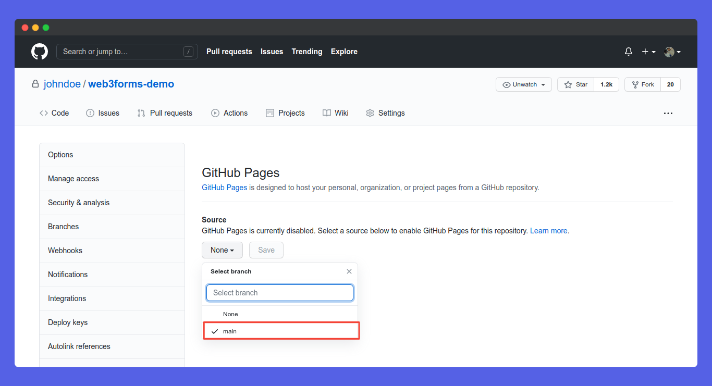
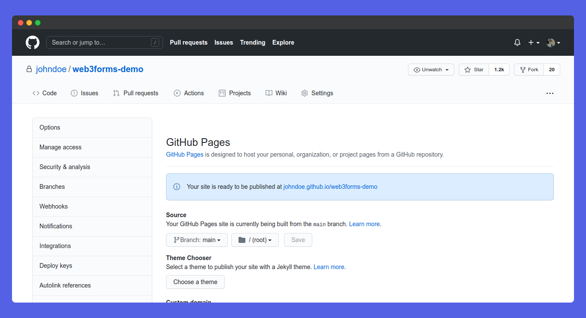

# Github

## Step 01: Create HTML Form

First of all we need to create a `html` page with web3forms. Learn how to setup on our [installation](https://docs.web3forms.com/getting-started/installation) page.

## Step 02: Create an account on Github


First Step is to create a Github account if you don't already have one.

## Step 03: Create a GIT Repository

Now, you should create a new GitHub repository and add your `html` code to your repo.

## Step 04: Add code to GIT repository

Follow the code to initialise and add your code files to your repo.

```bash
git init
git add index.html
git commit -m "first commit"
git branch -M main
git remote add origin your_origin_url
git push -u origin main
```

## Step 05: Go to Settings


On your github repository, you can see a tab called **Settings**, just click on the tab.

## Step 06: Go to Pages Table


On your settings page, you can see a tab called **Pages** on the left. Just click on tab.

## Step 07: Choose Branch



Here, you can should set your branch as `main` and click on **Save** button. You're good to go!

## Step 08: Congratulations! You're App is deployed



Congrats, You're app is now deployed on github. Your hosting url will be _username.github.io/repo_ You can now visit it! It will work absolutely fine. Well done! 👏

## Test App


Now, here comes the final part! It is time to test. Head over to the app, and submit the form. Open your mail, you can see a new one. It will look like this 👇



