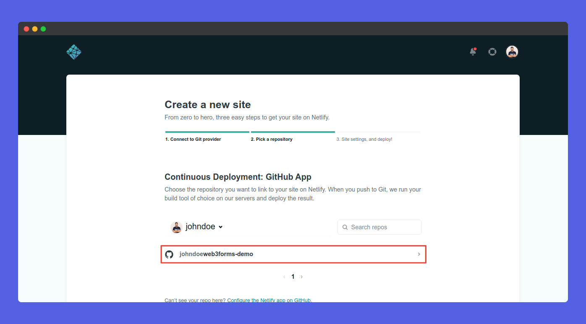
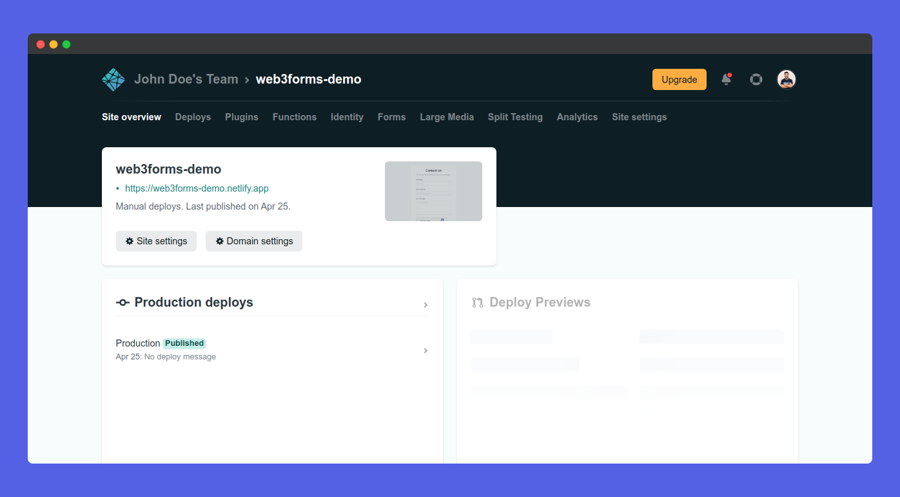

# Netlify

## Step 01: Create HTML Form

First of all we need to create a `html` page with web3forms. Learn how to setup on our [installation](https://docs.web3forms.com/getting-started/installation) page.

## Step 02: Create an account on Github

First Step is to create a Github account if you don't already have one.

## Step 03: Create a GIT Repository

Now, you should create a new GitHub repository and add your `html` code to your repo.

## Step 04: Create an account on Netlify

Head over to [http://netlify.com/](http://netlify.com/) and create an account on Netlify. If you already have one, sign in to your account. You will be redirected to your dashboard.

## Step 05: Create a New Project

Now, click [New Site From GIT](https://app.netlify.com/start) button from your dashboard.

## Step 06: Connect GIT Repository

Now, just click on **Github** button to connect Netlify with your Github Account.

## Step 07: Choose Github Repository

You will now be able to see your repos. Just click on the repository you want to deploy!

## Step 08: Deploy on Netlify

You can now add your details, Finally lets click on **Deploy Site** button and you're good to go!

## Step 09: Congratulations! You're App is deployed

Congrats, You're app is now deployed on Netlify. If you wish to change your domain, just click on **Domain Settings** and change your domain. You can now visit your App! It will work absolutely fine. Well done! 👏

## Test App

Now, here comes the final part! It is time to test. Head over to the app, and submit the form. Open your mail, you can see a new one. It will look like this 👇

