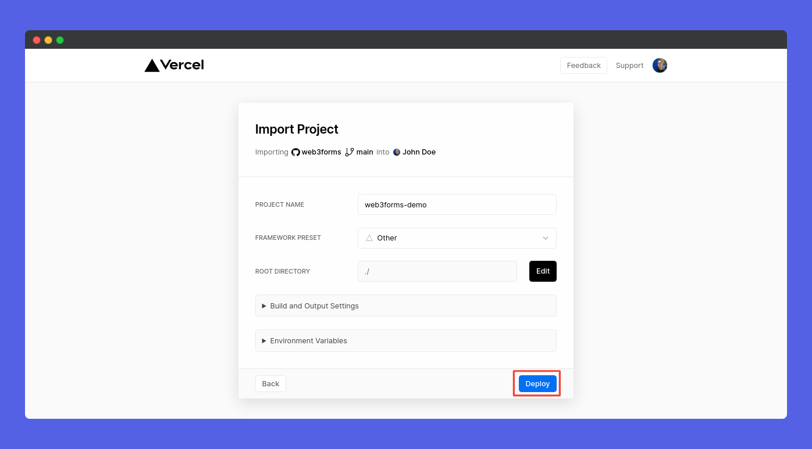
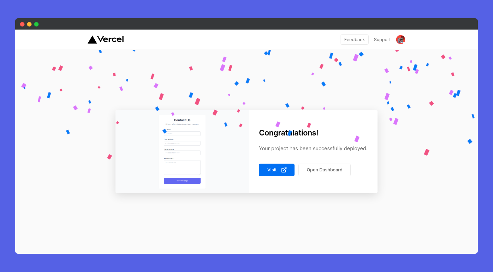

# Vercel

**Vercel Platform Guide:** [**https://web3forms.com/platforms/vercel-contact-form**](https://web3forms.com/platforms/vercel-contact-form)

### Step 01: Create an HTML Form

First of all, we need to create a `html` page with web3forms. Learn how to setup on our [installation](https://docs.web3forms.com/getting-started/installation) page.

### Step 02: Create a GIT Repository

Now, you should create a new GitHub repository and add your `html` files to your repo.

### Step 03: Create a New Project in Vercel

Now, click [New Project](https://vercel.com/new) button from your dashboard.

### Step 04: Import GIT Repository to Vercel

Now, you can see your repos, click on **Import** button near the repo you want to import.

### Step 08: Deploy Vercel App

Configure you name and settings. Click on **Deploy** button. You're good to go!

## Step 09: Congratulations! You're App is deployed

Congrats, You're app is now deployed on vercel. You can now visit it! It will work absolutely fine. Well done! 👏

## Test App

Now, here comes the final part! It is time to test. Head over to the app, and submit the form. Open your mail, you can see a new one. It will look like this 👇

